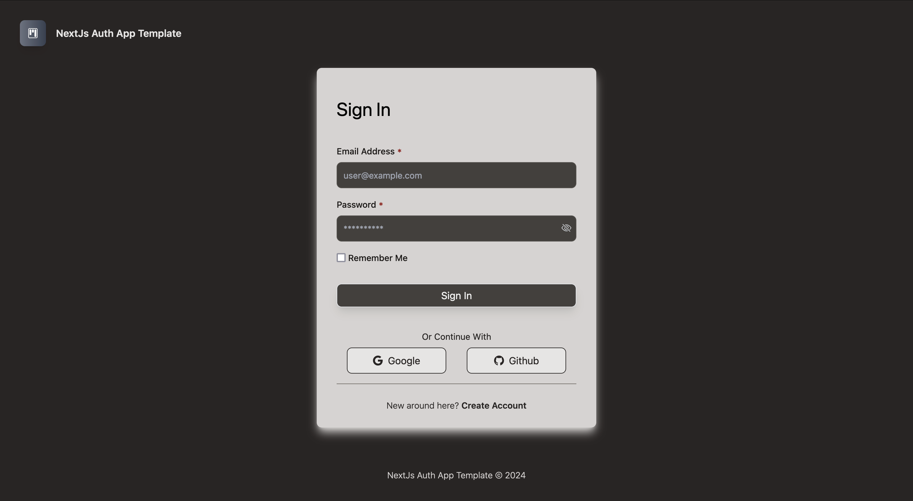

# next.js auth app

<p align="center"></p>

This project is a web application built using **Next.js v14** and **NextAuth.js v4** for authentication. It demonstrates how to implement user authentication with various providers, leveraging the powerful features of Next.js. It allows you to tailor it to your interests and needs, whether you're building a personal portfolio, a blog, or a business site.

## Features

- **Next.js (v14)**: Utilizes the latest features of Next.js for server-side rendering and static site generation.
- **NextAuth.js (v4)**: A complete authentication solution for Next.js applications, supporting multiple authentication providers.
- Generate jwt and refresh token
- **React**: A JavaScript library for building user interfaces.
- **Tailwind CSS**: A utility-first CSS framework for designing custom UIs.
- **Prisma ORM**: A modern database toolkit that simplifies database access and management.
- **JOSE**: A library for handling JSON Web Tokens (JWT) and secure authorization.

## Demo

https://nextjs-auth-app-template.vercel.app/sign/login

<p align="center"></p>

## Getting Started

### Prerequisites

Make sure you have the following prepared:

- Node.js (version 14 or higher)
- npm (Node package manager)
- A database (PostgreSQL, MySQL, MongoDb Atlas Cloud, etc.)

## Environment Variables

To run this project, you will need to add the following environment variables to your .env file

`NEXTAUTH_SECRET` : A secret used to encrypt session tokens and protect user authentication. Set this variable to a long, random string to ensure secure sessions.

`DATABASE_URL` : The connection string for your database. This variable is used by Prisma to connect to your database. Ensure the format is correct for your database type (PostgreSQL, MySQL, SQLite, etc.).

`GOOGLE_CLIENT_ID` & `GOOGLE_CLIENT_SECRET`: The client ID and client secret for your Google OAuth application. Obtain this from the Google Developer Console when setting up your application for Google sign-in.

`GITHUB_CLIENT_ID` & `GITHUB_CLIENT_SECRET` : The client ID and client secret for your GitHub OAuth application. This is obtained from your GitHub Developer settings and should be treated as sensitive information.

## Installation

Clone the repository:

```bash
git clone https://github.com/yourusername/nextjs-web-app-template.git
```

Install the dependencies:

```bash
npm install
```

Set up Prisma:

- Install the Prisma CLI:

```bash
npm install prisma --save-dev
```

- Initialize Prisma in your project:

```bash
npx prisma init
```

- Configure your database connection in the .env file:

- Define your data model in prisma/schema.prisma.

- Create the database tables:

```bash
npx prisma migrate dev --name init
```

## Deployment

Deploying your Next.js application on Vercel is straightforward. Follow these steps:

- Push your code to a GitHub, GitLab, or Bitbucket repository.

- Go to Vercel's website and sign up or log in.

- Click on the "New Project" button.

- Import your repository from GitHub, GitLab, or Bitbucket.

- Vercel will automatically detect that you're using Next.js and configure the necessary settings.

- Set up your environment variables (like DATABASE_URL) in the Vercel dashboard under the "Settings" section of your project.

- Click "Deploy" to launch your application.

After deployment, Vercel will provide you with a live URL for your application.

## Contributing

Contributions are welcome! Please fork the repository and submit a pull request.

## Contact

For questions or feedback, feel free to open an issue.
